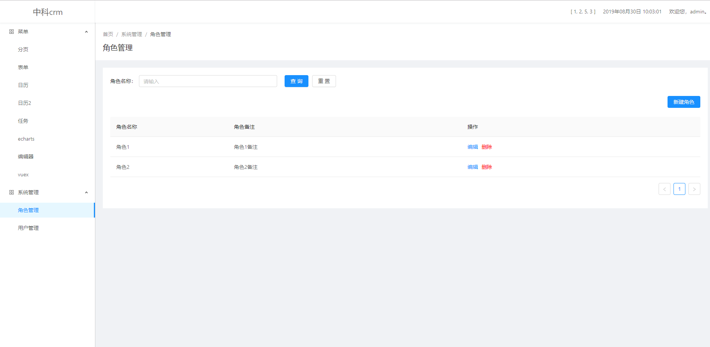
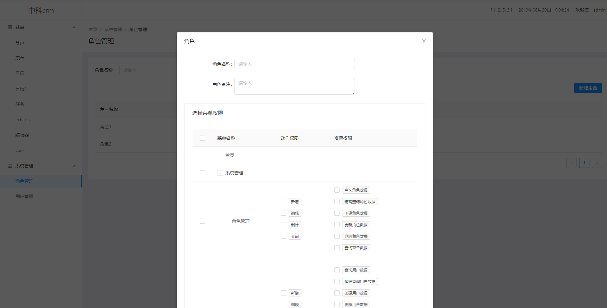

# ant（crm项目）

## 1.启动
### 安装依赖
`npm i`
### 启动项目
`npm run serve`
### 打包命令
`npm run build`

## 2.项目说明
项目为vue搭建，目前已依赖的组件：
* UI集成Ant：[Ant Design Vue官网](https://vue.ant.design/docs/vue/introduce-cn/)
* fullcalendar日历组件 [官网](https://fullcalendar.io/)
* vuex+vue-router+axios全家桶
* css预编译器(sass+less)
* echarts
* vue-quill-editor在线编辑器
* mockjs

## 3.相关截图

